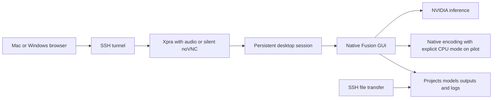

# VisoMaster Fusion cloud desktop implementation plan

Create a reproducible deployment of the complete native Fusion desktop on a rented NVIDIA GPU, controlled from a Mac or Windows browser. Keep face selection, analysis, previews, project state and rendering in the same native application. Use the resulting deployment to measure practical GPU requirements for 720p and 1080p, without depending on RTX Pro 6000 availability.

Status: the supplied RTX 4090 pilot is implemented, 5 October 2026. The fork,
additive Linux deployment, native GUI, actual CUDA inference, live native audio,
and eight short 720p/1080p benchmark profiles each passed three recordings.
The two opt-in CUDA settings passed five minutes of basic-profile interaction;
the user postponed the 30-minute test to manual use. The final local image passed
CPU services, SSH and clean persistence recreation. Smaller GPUs, Windows
usability, subjective audio/AV sync, fresh GPU-image startup and replacement-pod
checks remain untested. The stages below describe deployment qualification beyond
this pilot; their deferred gates are not claimed complete. See the
[validation record](cloud-desktop-validation.md) and
[operator guide](cloud-desktop-operations.md). The user's positive impression of
native Fusion comes from reports and observing its use, rather than a matched
quality test on these projects.

## Baseline and scope

Start from upstream `main` at `f2d6f5ebe190b631ee5c8972332083cf7f8a3e72`, the clean revision currently checked out locally. Pin the commit, dependency artifacts, container digest and model hashes. Do not follow a moving branch during installation or startup.

The first deployment runs `python main.py` and uses the native GUI and Record action. It does not introduce a ComfyUI wrapper, remote render API, Radeon backend or distributed preview service. Packaging changes belong in deployment files. Any essential Linux, encoding or persistence compatibility patch must be isolated, explained and tested separately from changes to face processing.

Evaluate development revision `407bc47895d593ebdb0dd53fb7137f1a62fa51b4` separately after the main baseline passes. It identifies as 3.16.0 and changes processing and workspace behavior; upgrading it while testing the deployment would confound results. The older `v3.12.3` release pin used by the existing adaptation is `9f9dd96dafc2c8a13469566bf6ef16ae09106627` and remains available for a diagnostic comparison.

| Verified source fact | Implementation consequence |
| --- | --- |
| [The entry point creates and shows a Qt window](https://github.com/VisoMasterFusion/VisoMaster-Fusion/blob/f2d6f5ebe190b631ee5c8972332083cf7f8a3e72/main.py). | Supply a visible desktop display, working Qt platform libraries and a normal application event loop. |
| [The README documents Windows 10 and 11](https://github.com/VisoMasterFusion/VisoMaster-Fusion/blob/f2d6f5ebe190b631ee5c8972332083cf7f8a3e72/README.md), while [provider selection implements CUDA, TensorRT, CPU and CoreML](https://github.com/VisoMasterFusion/VisoMaster-Fusion/blob/f2d6f5ebe190b631ee5c8972332083cf7f8a3e72/app/processors/utils/platform_support.py). | Linux is a compatibility experiment. The local Windows RX 7900 XT does not need to run inference when the entire app is remote. |
| [Current dependencies use Python 3.12 and CUDA 13 packages](https://github.com/VisoMasterFusion/VisoMaster-Fusion/blob/f2d6f5ebe190b631ee5c8972332083cf7f8a3e72/requirements_cu13.txt); [the package indexes include an ORT nightly source](https://github.com/VisoMasterFusion/VisoMaster-Fusion/blob/f2d6f5ebe190b631ee5c8972332083cf7f8a3e72/pyproject.toml). | Resolve and lock Linux artifacts explicitly. Check the actual host driver and loaded libraries; the README's older CUDA driver guidance is insufficient for this environment. |
| [Native SDR recording selects HEVC NVENC with main10](https://github.com/VisoMasterFusion/VisoMaster-Fusion/blob/f2d6f5ebe190b631ee5c8972332083cf7f8a3e72/app/processors/video_utils/video_encoding.py#L303-L347). | Require a real encode probe and a native export on each GPU candidate. An encoder appearing in FFmpeg's listing does not prove it works. |
| [Workspace state is stored relative to the application root](https://github.com/VisoMasterFusion/VisoMaster-Fusion/blob/f2d6f5ebe190b631ee5c8972332083cf7f8a3e72/app/ui/main_ui.py#L198-L201); [model and TensorRT caches also use application paths](https://github.com/VisoMasterFusion/VisoMaster-Fusion/blob/f2d6f5ebe190b631ee5c8972332083cf7f8a3e72/app/processors/models_processor.py). | Map every relevant writable path onto persistent storage and prove restoration in a fresh process and replacement pod. |
| [Workspace saving opens the destination with `w` and suppresses the dialog for failed autosaves](https://github.com/VisoMasterFusion/VisoMaster-Fusion/blob/f2d6f5ebe190b631ee5c8972332083cf7f8a3e72/app/ui/widgets/actions/save_load_actions.py#L1482-L1507). | An interrupted or full-storage save can damage prior state. Require verified snapshots and fault testing; packaging alone cannot guarantee preservation. |

## Proposed deployment

The pilot uses Ubuntu 24.04, Xfce and TigerVNC with a supervised persistent display. Xpra HTML5 plus a private PulseAudio sink adds live audio on loopback port 6082; noVNC/websockify remains a silent fallback on 6080. SSH tunnels are the default access path. Optional authenticated public access applies only to noVNC; public Xpra is refused. Component startup, native processing and client usability have separate validation records.

[noVNC supports modern browsers and requires a WebSocket connection](https://novnc.com/noVNC/). Validate input, display scaling, clipboard, seeking and sustained playback from the actual Mac and Windows connections. The desktop can draw in software while native inference uses CUDA. Do not inherit `QT_QPA_PLATFORM=offscreen` from the existing ComfyUI deployment script: launch against the visible display with the appropriate Qt platform plugin.

[RunPod exposes public HTTPS endpoints and does not support UDP on pods](https://docs.runpod.io/pods/configuration/expose-ports). Do not assume a UDP streaming client will work. Test the proxy for a 30 minute interactive session and a render lasting beyond 100 seconds; documentation about HTTP request timeouts is not proof of a specific WebSocket lifetime. If the proxy cannot sustain the session, evaluate authenticated TLS over exposed TCP or an SSH tunnel before changing the application architecture.

Authentication must be active before publishing the desktop endpoint. Supply credentials at runtime, reject a missing credential, and keep VNC and websockify bound internally. Do not expose raw VNC or put secrets in the image, manifest or logs. Add optional key based SSH for administration and media transfers. Use one desktop session and one Fusion process per entire `/workspace/fusion` root, enforced by an exclusive launcher lock verified on the selected storage. Refuse a second launcher without altering state. Treat an unknown or stale lock as a recovery decision, not permission to start another writer. Browser disconnection must not own the application's lifetime.

noVNC alone is not an audio delivery solution. Early visual testing may use it, but resolve live native preview audio during stage 2, before investing in recovery and final packaging. Investigate an audio capable transport compatible with the host, or document a user accepted preview audio limitation. Exported audio and synchronization are mandatory regardless of transport. Silent streaming must not be reported as complete native desktop parity. Also measure continuous playback delivery: responsiveness to a single still preview does not prove usable moving video.

## Repository and deliverables

When implementation is authorized, create a fork under the user's GitHub account and a `codex/cloud-desktop` branch at the pinned main revision. Keep the fork as `origin` and the original repository as `upstream`. Preserve upstream history and keep native fixes separate from deployment changes. Review inherited workflows before enabling fork automation; do not enable automatic GPU provisioning.

Create provisional setup, lock and probe files during stage 1 so the compatibility trial is repeatable. Complete the deployment files after the native functionality gates; finalize locks and publish the image after recovery validation:

| Planned file | Responsibility |
| --- | --- |
| `deploy/cloud-desktop/Dockerfile` | Pinned application source, Python environment, desktop dependencies, FFmpeg and service configuration. |
| `deploy/cloud-desktop/sources.lock.toml` | Upstream commit, base digest, dependency artifact hashes, desktop component versions and model manifest identity. |
| `deploy/cloud-desktop/requirements-linux.lock` | Reproducible Linux dependency resolution, with explicit origins for GPU wheels. |
| `deploy/cloud-desktop/entrypoint.sh` | Validate storage and credentials, choose compatible caches, start supervised services and emit useful status. |
| `deploy/cloud-desktop/launch-fusion.sh` | Set the working directory and visible display, select the isolated Python runtime and launch native Fusion. |
| `deploy/cloud-desktop/preflight.py` | Check writable storage, driver/runtime compatibility, GPU inference and actual HEVC main10 encoding; report failures without starting a broken session. |
| `deploy/cloud-desktop/supervisord.conf` and `nginx.conf` | Service lifetimes, authenticated WebSocket routing, orderly shutdown and logs. |
| `deploy/cloud-desktop/runpod-template.yaml` | Document exact template settings and required runtime inputs; no credentials or claim that this is a supported import format until verified. |
| `deploy/cloud-desktop/benchmark.py` and `results-schema.toml` | Collect repeatable timing/resource measurements and configuration identities. Document manual GUI steps and client measurements that the runner cannot observe. |
| `docs/cloud-desktop-operations.md` | Start, connect, transfer, save, render, download, stop, recover and change GPU procedures. |
| `docs/cloud-desktop-validation.md` | Measured compatibility, usability, restoration and GPU results, including failures and untested combinations. |

Use TOML or YAML for tracked metadata because the current `.gitignore` ignores JSON except `version.json`. Keep weights, projects, recordings, credentials and caches out of Git and container build contexts. Reuse the existing deployment's isolated environment, model hash verification and encode probe patterns; do not reuse its face pipeline patches or offscreen launcher.

## Persistent storage contract

The image supplies an immutable bare source archive, native overlay and installed runtime under `/opt/`. Startup stages verified native code at `/workspace/fusion/source/<upstream-sha>/` and uses it as the working directory; writable native paths map to durable namespaces below that root. Persistent user data lives under `/workspace/fusion`. Before completing the image, inventory writes made by startup, project save/load, preset save, embedding/reference operations, Job Manager and Record. Verify that symlinks or mapped paths actually survive each writer's save behavior; do not assume that persisting the desktop home directory covers native state.

| Persistent location | Contents and native mapping |
| --- | --- |
| `projects/<project>/` | Uploaded media, source images, explicitly saved workspaces, embeddings and completed outputs. Paths remain identical across pod replacements. |
| `native/<upstream-sha>/` | Native `last_workspace.json`, `jobs/`, legacy `.jobs/`, `presets/`, application settings and any additional state found in the write inventory. Link the native paths here. |
| `assets/<upstream-sha>/model_assets/` | Required model weights, shipped seed assets and externally stored reference KV data. Seed tracked assets idempotently and verify downloads by hash. Do not overwrite user reference data during initialization. |
| `cache/<compatibility-key>/` | TensorRT engines and timing/context files, Torch compilation caches and disposable temporary files. Map native `tensorrt-engines` and relevant subdirectories here. |
| `profile/` and `logs/` | Desktop preferences and application, preflight, supervisor and crash logs. |

Treat model weights and external reference data as durable assets, not disposable caches. Key compiled caches by platform, exact GPU identity/architecture, dependency versions, upstream revision and model hashes. Start with CUDA for the first functional probe, then validate the intended native TensorRT configuration separately. [TensorRT engines have platform, version and GPU portability constraints](https://docs.nvidia.com/deeplearning/tensorrt/latest/getting-started/support-matrix.html); switching GPUs must select a compatible cache or build a new one without deleting project data.

[RunPod network volumes persist independently of compute but constrain pod placement to their datacenter, require Secure Cloud, and are attached during deployment](https://docs.runpod.io/storage/network-volumes). GPU substitutions are therefore limited to compatible supply at that location. For another location, copy and verify durable data before switching; volumes do not synchronize automatically. Never run two Fusion writers against the same project state. Provide a backup and restore procedure for projects and references; a persistent volume alone is not a backup.

Closing the browser should leave the session and render alive. Before closing Fusion or replacing/stopping a pod, explicitly save while idle, check the save log and workspace file, and create a timestamped known-good snapshot of the workspace and its referenced assets. Verify snapshots by restoring a copy and checking assignments and settings; retain prior good versions. Test whether native close saves finish successfully rather than assuming they do. If fault tests expose unacceptable state loss, implement an isolated atomic-save/recovery fix and test it without changing face processing.

Stopping or deleting the pod ends processes and interrupts an active render; restarting restores saved projects, not live memory or a guaranteed frame checkpoint. Mark interrupted outputs clearly and verify completed outputs before distributing them. GPU rental includes editing and startup time, and storage billing continues while compute is offline.

## Implementation stages and gates

1. **Freeze the baseline and test prerequisites.** Record the pinned source, exact feature/model/export profile, representative clips and trial budget. Resolve Linux dependencies and the Qt/media backend in a disposable environment using provisional setup/probe files; capture artifact hashes. Audit writable paths and fork workflows. Select and record an available GPU SKU and location with adequate initial headroom, provisionally a compatible 24 GB class device, rather than requiring RTX Pro 6000. Gate: dependency imports and the visible native window work; actual model execution uses the intended GPU backend and the profile's real encoding path succeeds.
2. **Complete one native project on the remote desktop.** Import sources and 720p/1080p clips, find faces, assign identities, change settings, seek, play processed previews, use markers and record segments. Exercise issue scanning, dropped-frame handling and Job Manager if selected for the intended workflow. Export through native Record with source audio and inspect downloaded results locally. Test a 30 minute browser session and disconnect during a long render. Record delivered playback cadence, stalls, readability and network conditions from both clients; settle the preview audio decision. Gate: native controls and moving previews meet the agreed usability criteria, outputs are correct, the session survives disconnection, and no application processing has been replaced.
3. **Prove storage and recovery.** Save a project containing multiple assignments, a merged embedding, marker changes, ranges, exact processing controls, issue/dropped-frame state and external reference data where used. Verify a known-good snapshot, close and reopen Fusion, then replace the pod while retaining the volume. Confirm each state element and output path. Repeat on a different compatible GPU with fresh caches; test interrupted recording, interrupted saving, full storage, second-launch refusal and transfer integrity using disposable project copies. Gate: verified snapshots recover user data after faults, ordinary replacement and GPU change preserve state, and failures do not silently lose assignments or report partial output as complete.
4. **Package and measure.** Build and publish an immutable image only after the earlier gates pass; publish no media or secrets. Deploy it into a fresh pod from the documented template without manual environment repairs. Revalidate both clients and the chosen audio behavior, run the GPU comparison against this image and write the operator guide. Gate: the fresh deployment reproduces the accepted session and produces an evidence backed GPU recommendation for each resolution/profile, including cold initialization and a sustained session on each finalist.
5. **Evaluate newer native features separately.** Optional follow-on: test the pinned development revision with a separate state/model namespace. Compare shared settings first, then relevant new features independently. Repeat save/load and GPU measurements before promoting it. Gate: improved results and acceptable performance are demonstrated on the user's footage; development is not required to finish the baseline deployment.

Each gate produces a validation record with the image/source identity, dependency and model hashes, GPU SKU/location/driver details, loaded GPU libraries, container driver capabilities, selected and effective provider, project settings, input hashes, output metadata and relevant logs. Verify effective ONNX and Torch execution on representative models rather than inferring it from available provider names or `torch.cuda.is_available()`. Record failed gates and the next decision; do not label a running container as a working Fusion deployment.

## GPU measurement and acceptance

Use the same source material and settings for every candidate. Include a normal one face clip and a difficult clip with profiles, occlusion, multiple faces, a marker change and a segment boundary. Prepare both 720p and 1080p variants, preferably 30 to 60 seconds each. Define a profile matching the current intended workflow and a separate heavier profile for selected restorers, denoisers or other additional features. Before provisioning, record exact model/restorer choices, provider, precision, concurrency, input FPS, SDR/HDR setting and export settings. The proposed first profile is SDR with native HEVC main10; an HDR profile uses the separate native `libx265` path and needs its own preflight and measurements. Resolution alone cannot specify memory or throughput requirements.

Measure cold startup, download and compilation time/peak memory separately from warm analysis, preview and recording, including failures. Record source import and Find Faces time, median and p95 input-to-visible-preview latency, delivered playback FPS/cadence and stalls, export FPS, elapsed render time, peak total GPU memory, CPU/RAM use, transfer time and actual hourly rental rate. Distinguish Fusion compute latency from the end-to-end browser experience. Repeat warm measurements three times; verify the downloaded video with frame count, duration, resolution, audio and visual inspection of the difficult intervals. Compare TensorRT configurations only after their caches are ready and settings are fixed. Each finalist must also pass a representative sustained session of at least 30 minutes, including seeking, the intended model changes and a longer render; short clips alone do not establish daily-use stability.

Proposed initial efficiency targets, to agree before the paid comparison: warm preview p95 at most 2 seconds, recording no slower than twice the source duration, no memory failures and at least 15 percent observed VRAM headroom in warm operation. Cold cache creation must also succeed on the candidate itself within its memory limit; do not recommend a GPU that only works with engines built on a larger device. Set a delivered playback cadence/stall limit and readability requirement with the user before stage 2. These are acceptance targets, not performance predictions. Record any revised targets before selecting a minimum.

Start with the working GPU, then try lower memory/cost tiers offered with compatible drivers and NVENC, such as 16 GB and 12 GB classes. Continue lower only when the prior result has sufficient headroom and the comparison is useful. Report actual GPU SKUs, provider and location. Report the lowest tested GPU that passes each named resolution/profile and the most economical tested choice. A lower untested tier remains unknown; a 12 GB pass does not prove 12 GB is the absolute minimum. Do not extrapolate results to every native feature or development revision.

Proposed trial ceilings are two billed GPU-hours for the Linux pilot, at most three GPU SKUs and six billed GPU-hours for the comparison, and a $50 total incremental cloud-cost cap. Agree these limits and current rates before execution; stop at the first exceeded limit, repeated compatibility failure or insufficient remaining budget to complete a meaningful gate. Do not start another paid candidate automatically. An incomplete comparison is reported as incomplete and needs a further budget decision, not an invented minimum.

For cost comparison, use the same stated workload, provisionally one cold start, 30 minutes of editing and one 10 minute source render per profile. Compute billed session cost from measured startup/compilation, editing and export time multiplied by the actual hourly rate; add attributable storage and transfer charges where applicable. Record shared ongoing storage costs separately. This workload is a comparison assumption, not a prediction of the user's usage. Lowest tested passing GPU and cheapest tested session may be different devices.

| Acceptance area | Evidence required before declaring deployment ready |
| --- | --- |
| Native functionality | Sources, face detection, assignments, parameter changes, seeking, playback, markers, segments and native Record demonstrated on representative footage. |
| Client access | Usable Mac and Windows sessions, authenticated HTML/WebSocket access, scaling/input, agreed playback cadence and readability under recorded network conditions, sustained connection and successful reconnect. |
| Media delivery | Verified uploads/downloads; locally inspected full resolution exports with expected frames, duration and synchronized audio. Preview audio support or its explicitly accepted limitation recorded. |
| Persistence | Fresh process and replacement pod restore all selected project state; known-good snapshots restore after save faults; a second launcher is refused; a different GPU uses compatible or rebuilt caches. |
| Failure handling | Missing credential, unavailable GPU/runtime, failed encoding, full storage and interrupted render/save produce visible failures and preserve or recover prior known-good data. |
| Reproducibility | Fresh image deployment passes without manual repair; every benchmark is tied to its code, model, dependency and configuration identities. |
| GPU conclusion | Measured 720p and 1080p results with exact feature profiles/targets, cold compilation success, sustained stability, VRAM headroom and stated workload/session cost; no invented minimum or FPS estimate. |

## Decisions if a gate fails

If Linux cannot reproduce native functionality, capture the exact failing component and test an appropriate Windows NVIDIA desktop host before expanding custom application code. Do not assume that RunPod provides a Windows desktop image. If native NVENC fails, choose a supported GPU first; any software encoding fallback is a separate explicit patch and benchmark, not proof that the stock path works.

If browser playback, latency or audio cannot meet the user's needs, assess another supported transport first. A local UI plus remote final rendering bridge remains a separate project, conditional on proving acceptable local CPU interaction; it is not an automatic fallback hidden inside this deployment plan.

The user subsequently authorized implementation on the supplied running RTX 4090 pod and selected live preview audio and multiple restoration comparisons. The fork and native cloud pilot now exist; current evidence and failed gates are recorded in `cloud-desktop-validation.md`. The two-hour pilot estimate was exceeded while resolving dependency, memory, frame-order and audio-remux defects; the supplied pod remained the only GPU resource. No additional paid pod has been provisioned. The proposed comparison budget and smaller-GPU rentals remain decisions for a later comparison, with the current pilot's limitations made explicit first. The initial 10-second clips bound diagnostic cost; they do not satisfy the proposed difficult 30–60-second footage, long-render or subjective client acceptance gates.

## Independent review

Astra reviewed the draft read-only and recommended the architecture with targeted revisions. All seven material recommendations were incorporated: verified save/recovery snapshots and permission for an isolated persistence fix; one writer per entire storage root; early moving-video/audio validation; exact native feature/encoder profiles and effective backend checks; cold compilation and sustained-session measurements; bounded paid trials and explicit session-cost calculations; and provisional setup plus repeatable validation files before final packaging.

The primary agent independently checked the pinned revisions and source links, native SDR/HDR encoder branches, provider selection, application-relative state/cache paths and truncating workspace-save behavior. Requested advisor settings were `gpt-6-astra`, high reasoning effort and no inherited conversation turns; the dispatch tool supplied no execution metadata confirming actual settings. Review is advice, not proof of Linux compatibility, deployment readiness or measured performance. Implementation now follows this plan; actual results, departures and remaining limits are tracked in the validation record.
